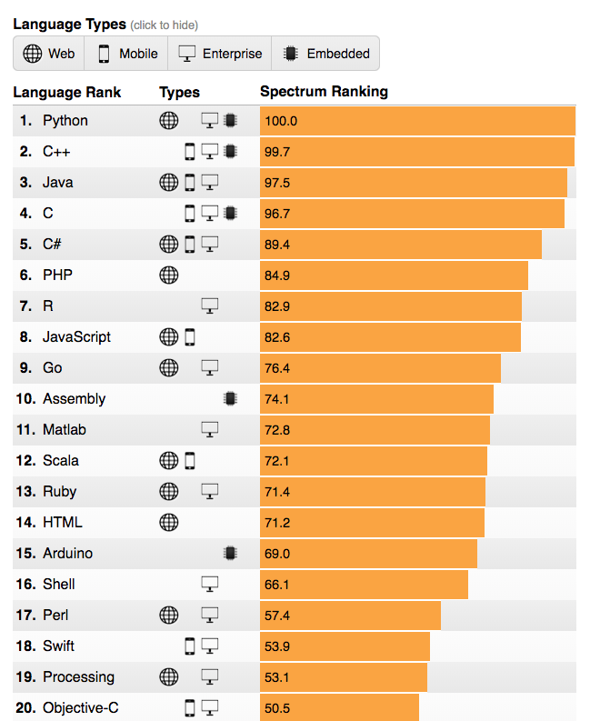

# 第一章 Python入门
## Python简介

- Python的创始人为吉多·范罗苏姆
- 来源： 1989年的圣诞节期间，吉多·范罗苏姆为了在阿姆斯特丹打发时间，决心开发一个新的脚本解释程序，作为ABC语言的一种继承。之所以选中Python作为程序的名字，是因为他是BBC电视剧——蒙提·派森的飞行马戏团的爱好者。

## Python历史
- 1991年，第一个Python编译器诞生。它是用C语言实现的，并能够调用C语言的库文件。从一出生，Python已经具有了：类，函数，异常处理，包含表和词典在内的核心数据类型，以及模块为基础的拓展系统。
- Granddaddy of Python web frameworks, Zope 1 was released in 1999
- Python 1.0 - January 1994 增加了 lambda, map, filter and reduce.
- Python 2.0 - October 16, 2000，加入了内存回收机制，构成了现在Python语言框架的基础
- Python 2.4 - November 30, 2004, 同年目前最流行的WEB框架Django 诞生
- Python 2.5 - September 19, 2006
- Python 2.6 - October 1, 2008
- Python 3.0 - December 3, 2008
- Python 3.1 - June 27, 2009
- Python 2.7 - July 3, 2010
- In November 2014, it was announced that Python 2.7 would be supported until 2020, and reaffirmed that there would be no 2.8 release as users were expected to move to Python 3.4+ as soon as possible
- Python 3.2 - February 20, 2011
- Python 3.3 - September 29, 2012
- Python 3.4 - March 16, 2014
- Python 3.5 - September 13, 2015

## Python语言的流行
- https://spectrum.ieee.org/static/interactive-the-top-programming-languages-2018

## Python应用领域
### web开发
python非常便于功能扩展，多年来形成了大量优秀的web开发框架。如目前优秀的全栈的django、框架flask，都继承了python简单、明确的风格，开发效率高、易维护，与自动化运维结合性好。

### 人工智能
基于大数据分析和深度学习而发展出来的人工智能本质上已经无法离开python的支持，目前世界优秀的人工智能学习框架如Google的TransorFlow 、FaceBook的PyTorch以及开源社区的神经网络库Karas等是用python实现的。

### 系统运维
Python在与操作系统结合以及管理中非常密切，目前所有linux发行版中都带有python，且对于linux中相关的管理功能都有大量的模块可以使用。

### 大数据分析
量化交易，金融分析，在金融工程领域，Python不但在用，且用的最多，而且重要性逐年提高。
庞大而活跃的科学计算生态，在数据分析、交互、可视化方面有相当完善和优秀的库。

### GUI图形
PyQT, WxPython,TkInter

## Python特点
### 优点
- 简单易学
- 开发效率高
- 高级语言
- 可移植性
- 可扩展性
- 可嵌入性

### 缺点
- 速度慢
- 代码不能加密
- 多线程问题

## Python解释器
### CPython
安装好Python 2.7后，我们就直接获得了一个官方版本的解释器：CPython。这个解释器是用C语言开发的

### IPython
IPython是基于CPython之上的一个交互式解释器。

### PyPy
PyPy是另一个Python解释器，它的目标是执行速度。PyPy采用JIT技术，对Python代码进行动态编译，所以可以显著提高Python代码的执行速度。

### Jython
Jython是运行在Java平台上的Python解释器，可以直接把Python代码编译成Java字节码执行。

## Python开发规范
PEP8英文：http://jython.cn/dev/peps/pep-0008/
PEP8中文：https://python.freelycode.com/contribution/detail/47
